# Acpc user manual

Acpc turns an Android phone or tablet into an Amstrad CPC. It emulates the
CPC 464, 664 and 6128, the CPC 6128 Plus and the GX4000 console, and it runs
games from disc images (`.dsk`), tapes (`.cdt`), cartridges (`.cpr`) and
snapshots (`.sna`).

The screenshots below come from the app itself. The interface exists in
English and French; it follows the language of the phone.

## Contents

1. [First run: importing the Amstrad ROMs](#1-first-run-importing-the-amstrad-roms)
2. [The library](#2-the-library)
3. [Getting games from a server](#3-getting-games-from-a-server)
4. [Playing](#4-playing)
5. [The in-game menu](#5-the-in-game-menu)
6. [The CPC keyboard](#6-the-cpc-keyboard)
7. [Tapes](#7-tapes)
8. [Cartridges: CPC Plus and GX4000](#8-cartridges-cpc-plus-and-gx4000)
9. [Settings](#9-settings)
10. [Using the CPC as a computer](#10-using-the-cpc-as-a-computer)
11. [Troubleshooting](#11-troubleshooting)

## 1. First run: importing the Amstrad ROMs

The Amstrad firmware belongs to its rights holders and is not bundled with
the app, so the first thing to do is import your own copies. Tap **ROMs** on
the main screen, then **Import ROM files…** and select the files; they are
recognised by their content, so their names do not matter.

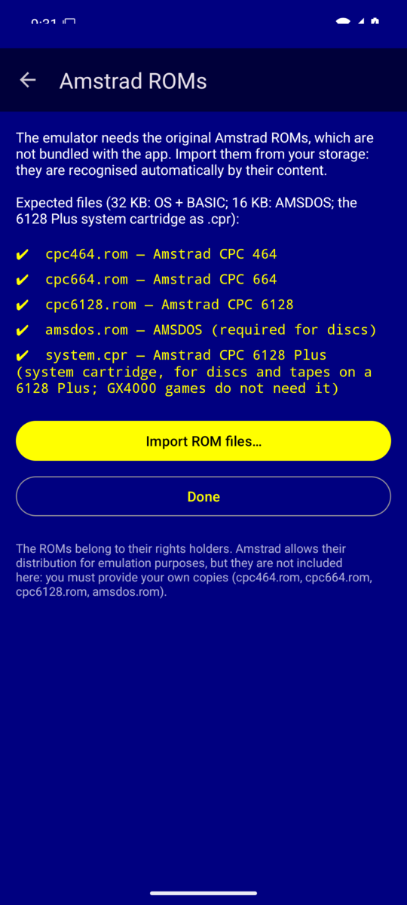

| File | Size | What it is |
|------|------|------------|
| `cpc464.rom` | 32 KB | CPC 464 firmware and BASIC 1.0 |
| `cpc664.rom` | 32 KB | CPC 664 firmware and BASIC 1.1 |
| `cpc6128.rom` | 32 KB | CPC 6128 firmware and BASIC 1.1 |
| `amsdos.rom` | 16 KB | AMSDOS, needed to read discs |
| `system.cpr` | cartridge | CPC 6128 Plus system cartridge |

You only need the ROM of the model you want to run, plus AMSDOS for discs.
GX4000 games need no ROM at all: the cartridge is the machine's firmware.

## 2. The library

Everything you play is listed on the main screen. A badge shows what each
entry is: **DSK** for a disc, **CDT** for a tape, **CPR** for a cartridge and
**SNA** for a snapshot.

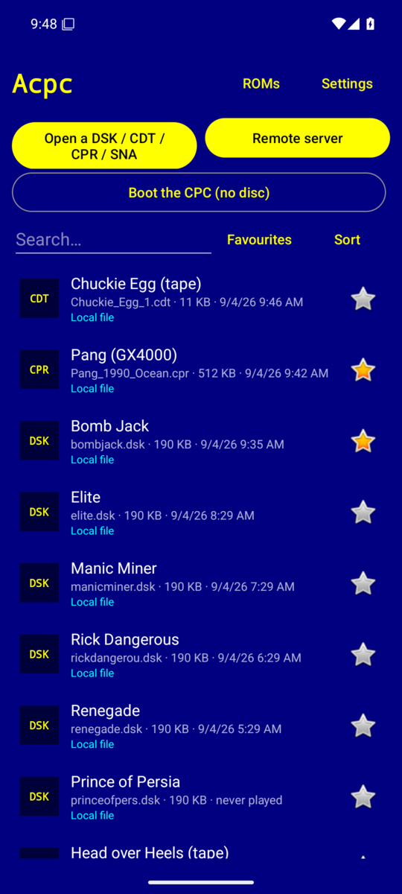

- **Open a DSK / CDT / CPR / SNA** picks a file from the phone's storage. A
  `.zip` archive is accepted and unpacked automatically.
- **Boot the CPC (no disc)** starts the machine on the BASIC prompt.
- **Search**, **Favourites** (the star on each row) and **Sort** (recently
  played, name, date added) narrow the list down.

A long press on a game opens its menu:

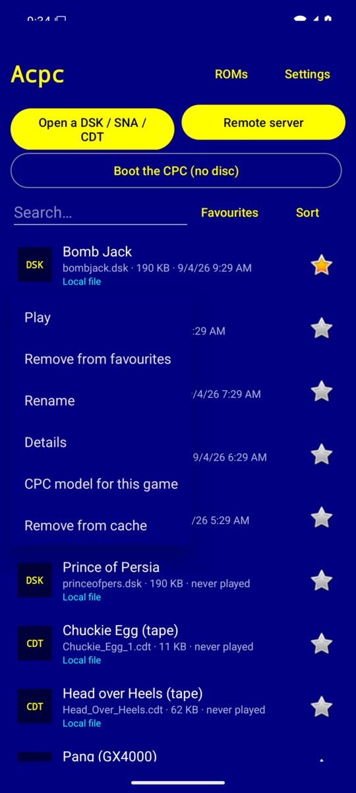

**Details** shows what is inside the file: geometry and AMSDOS catalogue for
a disc, block count and running time for a tape, page count for a cartridge.

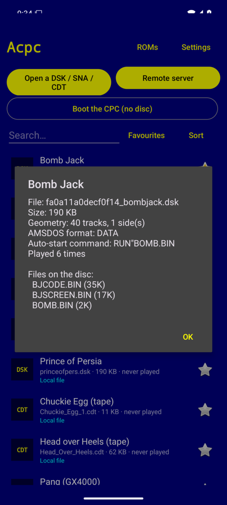

**CPC model for this game** overrides the default machine for this game only,
which is useful for a program that needs a 464 or a 6128 Plus.

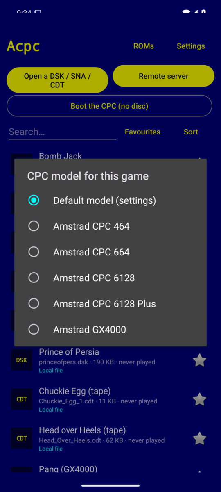

## 3. Getting games from a server

**Remote server** downloads games over HTTP. Give it the address of a file,
or of a folder listing files: an ordinary web index or an archive.org
collection. The default entry points at a large CPC collection.

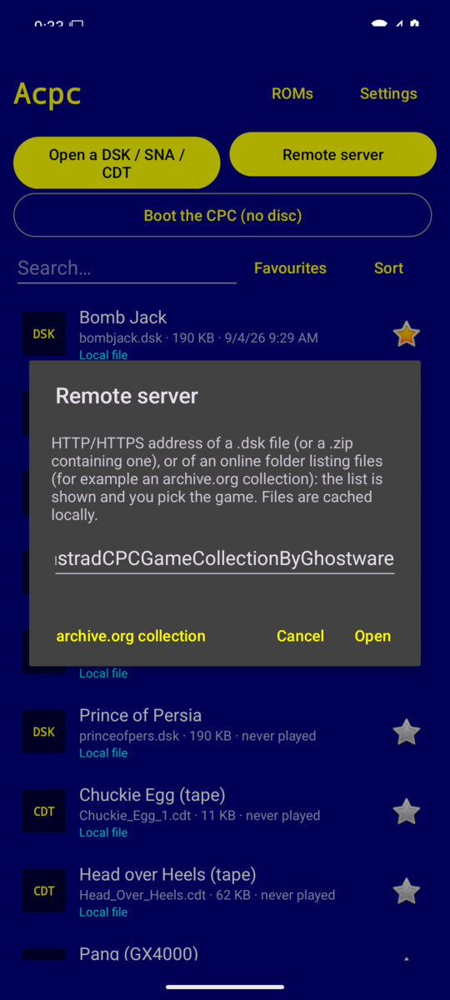

The listing is browsable and searchable; one tap downloads a game, caches it
and adds it to the library.

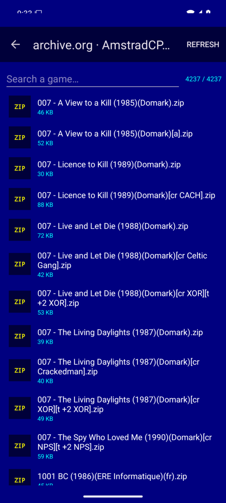
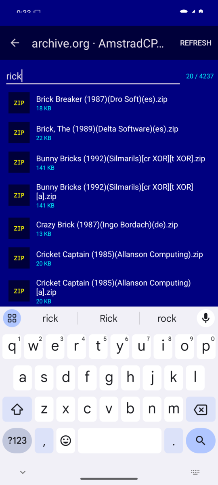

## 4. Playing

Tap a game to start it. The disc is inserted, the machine boots and the
program is started for you (`RUN"…`), so a game reaches its title screen on
its own.

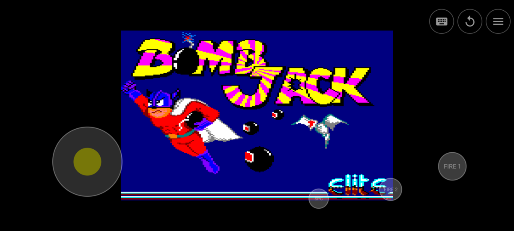

On screen you get a joystick on the left, **FIRE 1** and **FIRE 2** on the
right, and a small **SPC** key for space. FIRE 1 is the button most games
use. Three buttons sit in the top right corner: the CPC keyboard, a reset
button and the menu.

The controls can be moved: open the menu, choose **Move touch controls** and
drag them where your thumbs are. **Touch controls profile** offers ready-made
layouts for platform games, adventures and shoot'em ups. Bluetooth or USB
gamepads and keyboards work as well and can be remapped in the settings.

## 5. The in-game menu

The menu button opens everything you can do without leaving the game.

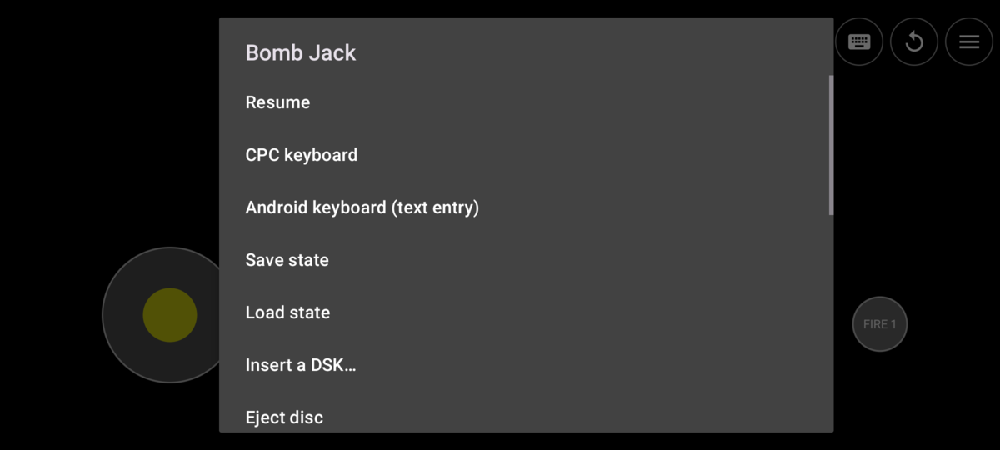
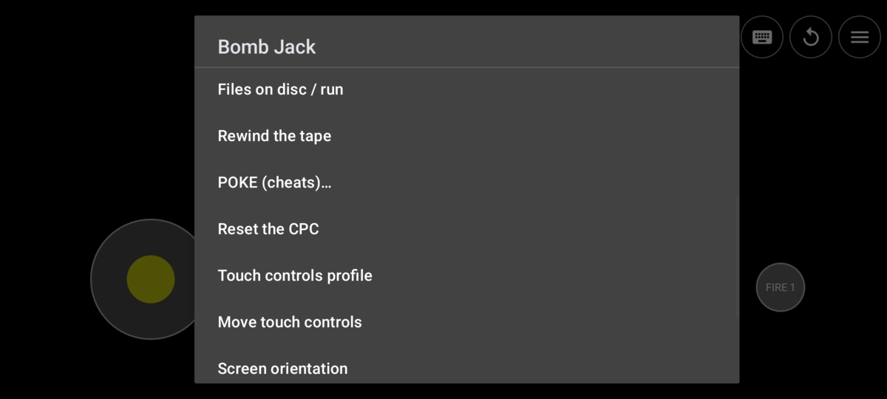

- **Save state** and **Load state** keep four slots per game, so you can
  stop in the middle of a level and come back to it later.

  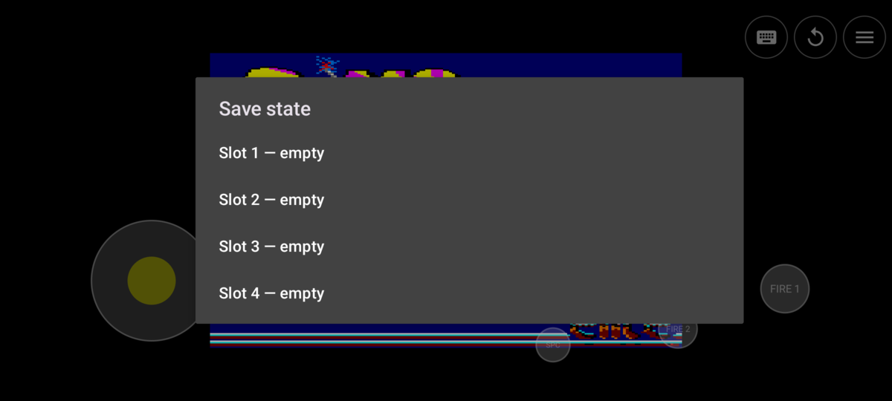

- **Files on disc / run** lists the AMSDOS catalogue and runs any file on it,
  which is how you start the second program on a compilation disc.

  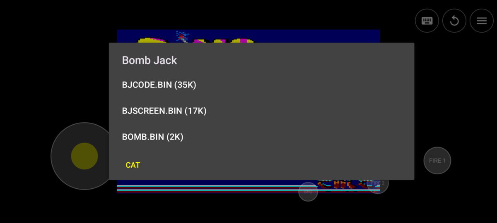

- **Insert a DSK…** swaps the disc for a multi-disc game, **Eject disc**
  empties the drive.
- **POKE (cheats)…** applies POKEs while the game runs, for example infinite
  lives. Write them as `address,value`, separated by semicolons, in decimal
  or in hexadecimal with `&`.
- **Reset the CPC** power-cycles the machine and restarts the game. A long
  press on the reset button in the corner does it without asking.
- **Mute** silences the sound for one session.
- **Quit emulator** returns to the library. Save a state first if you want to
  come back where you were.

  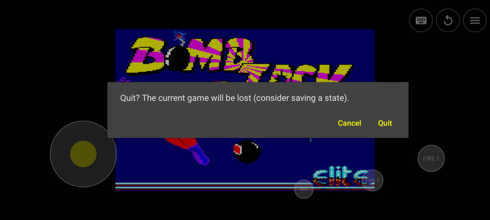

## 6. The CPC keyboard

The keyboard button shows the full 6128 keyboard, with the function keys, the
arrows and a FIRE key. It is multi-touch, and SHIFT and CTRL are sticky, so
you can type combinations with one finger.

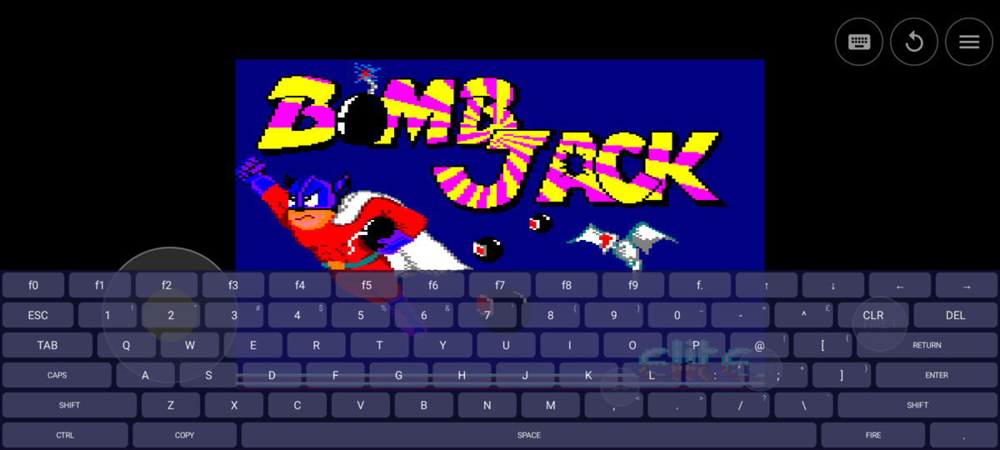

For long text, **Android keyboard (text entry)** in the menu opens the
phone's own keyboard and sends what you type to the CPC.

## 7. Tapes

A `.cdt` tape behaves like the real thing: the app types `RUN"` and presses a
key at the "Press PLAY then any key" prompt. A counter in the top left corner
shows the position, the length and whether the tape is moving.

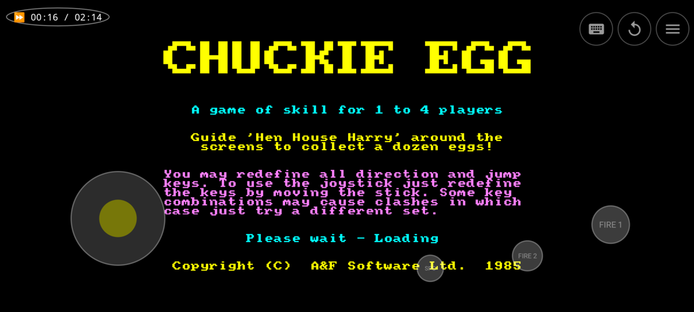

With **Fast tape loading** on (the default), the emulator runs at full speed
while the motor turns, so a five-minute load takes a few seconds. The counter
stops when the tape reaches its end.

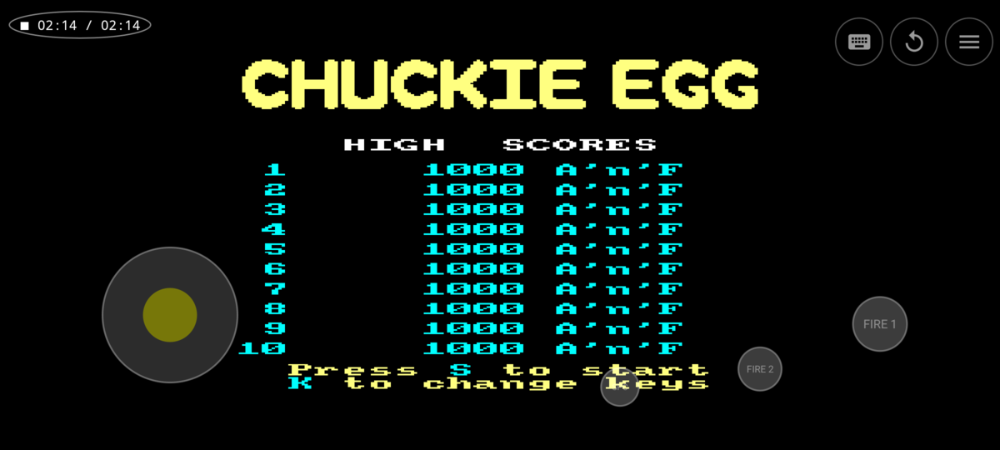

**Rewind the tape** in the menu takes it back to the start, which is what you
need for a game that asks you to load its second part.

## 8. Cartridges: CPC Plus and GX4000

A `.cpr` cartridge starts a GX4000 console: no ROM to import, the cartridge
holds the firmware. The Plus hardware is emulated, so these games get their
hardware sprites, their 4096-colour palette, the split screen and the DMA
sound chip.

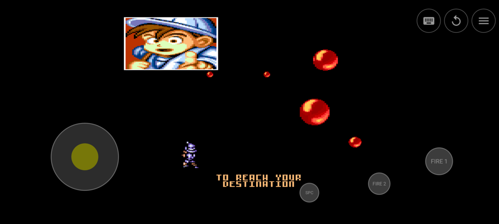
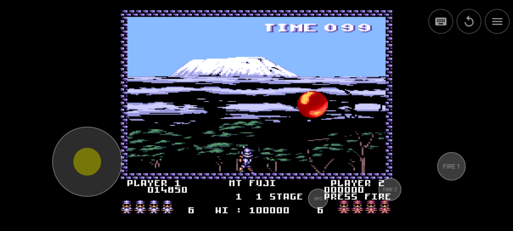

The GX4000 pad has two buttons, and they are the on-screen FIRE 1 and FIRE 2.
Games that say "press fire 1 on joypad 1" mean the large button.

If you also import the 6128 Plus system cartridge as `system.cpr`, you can
choose **Amstrad CPC 6128 Plus** as the machine and run ordinary discs and
tapes on it. That is how a disc program written for the Plus, such as Jet Set
Willy+, gets its ASIC.

## 9. Settings

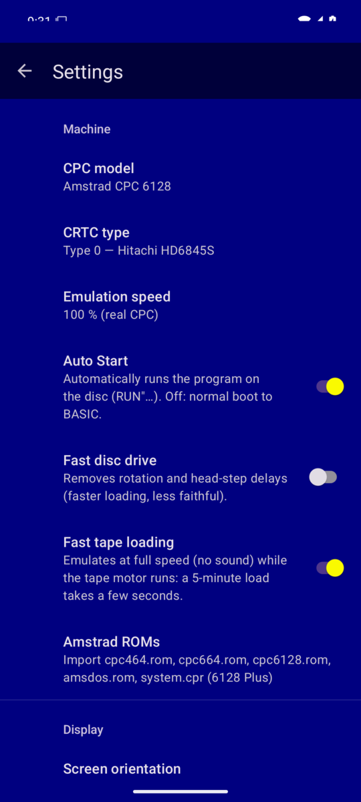

**Machine**: the default CPC model, the CRTC variant (type 0 suits nearly
every game), the emulation speed, whether programs start on their own, and
the two accelerators. **Fast disc drive** removes the drive's mechanical
delays; **Fast tape loading** does the same for tapes.

**Display**: screen orientation, scaling (fit, integer, stretch or pixel
perfect), the monitor colour (the colour CTM644, the green GT65 or
greyscale), scanlines and bilinear smoothing.

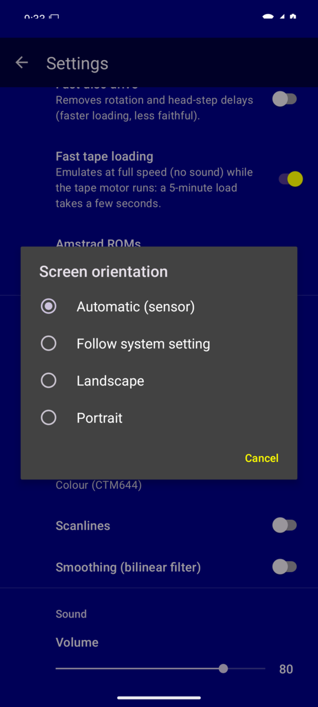

**Sound**: volume, mute and the audio buffer size. A smaller buffer reacts
faster, a bigger one is safer on a slow phone.

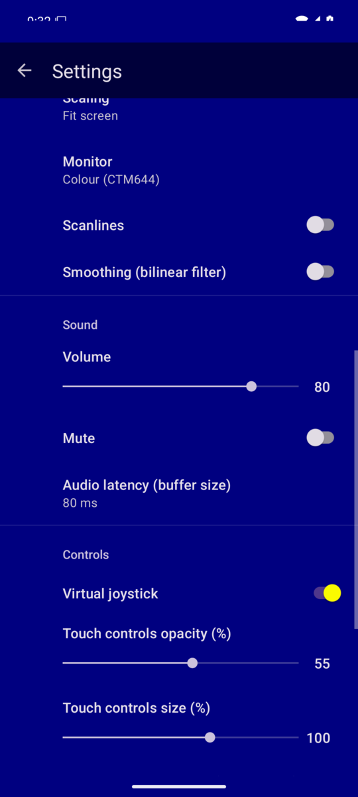

**Controls**: whether the virtual joystick is shown, the opacity and size of
the touch controls, the height of the virtual keyboard, haptic feedback, and
the two remapping screens for physical keyboards and gamepads.

**Developer**: an overlay with the frame rate, the emulation speed, the Z80
registers and the state of the CRTC and the disc controller.

## 10. Using the CPC as a computer

**Boot the CPC (no disc)** gives you a bare machine at the BASIC prompt.

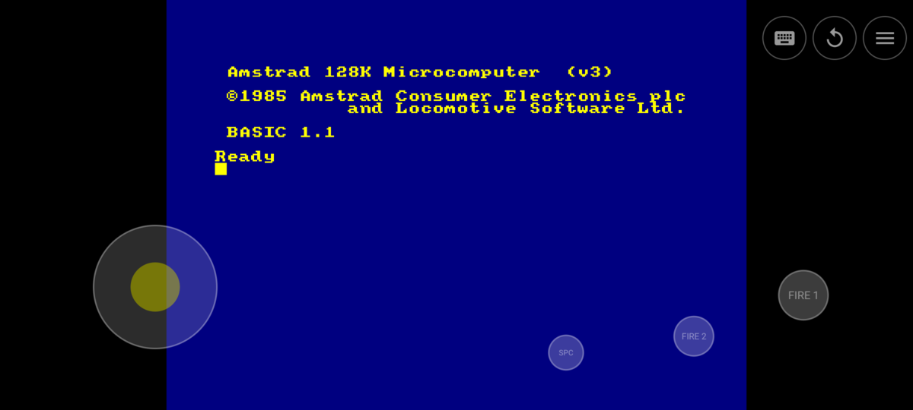

Open the CPC keyboard and type as you would on the real thing: `CAT` lists a
disc, `RUN"NAME` starts a program, and BASIC programs can be typed in and
run. Discs are written back to their file, so a game that saves its progress
or its high scores keeps them.

## 11. Troubleshooting

**"Missing ROM for the …"** — the model you chose has no firmware yet. Tap
ROMs and import it, or pick another model in the settings.

**A game stays on a black screen or a loading picture** — big games take
between 40 and 90 seconds to load at the speed of a real drive. Turn on
**Fast disc drive** if you would rather not wait.

**A game ignores the fire button** — some games want a key instead of the
joystick. Open the CPC keyboard and press the key the game asks for, or
remap the on-screen buttons through **Touch controls profile**.

**The sound crackles** — raise the audio latency in the settings; the phone
then has a bigger buffer to fill.

**A game misbehaves on the 6128** — try the CPC 464 for an old tape-era
game, through **CPC model for this game** so the choice sticks to it.
